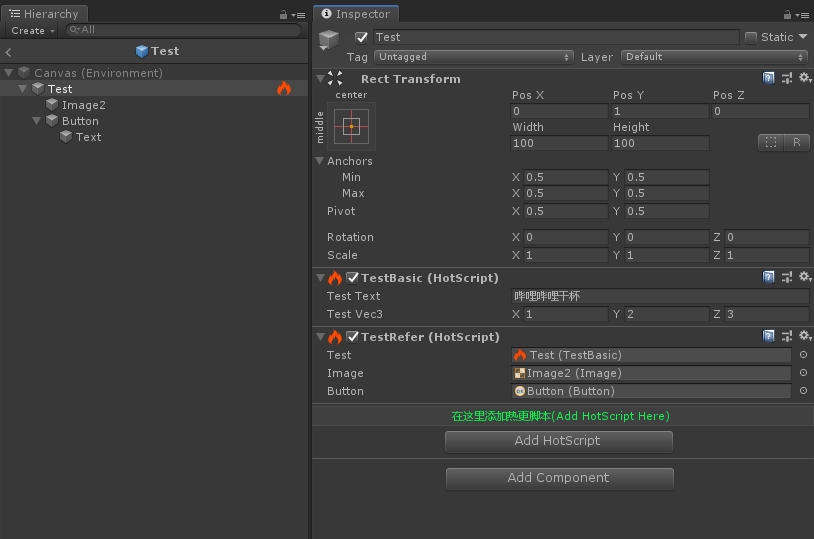

# HotUnity
基于 ILRuntime 实现使用 Unity **脚本方式** 的热更新脚本。

### 目的：
- 在热更项目中，HotScript 定义为热更脚本，所有继承该脚本的类，都可以以 Unity 脚本的方式添加到 GameObject 上并通过 Editor 显示、编辑、引用等，这样极大方便了热更项目的脚本使用。
- 因未考虑性能问题，仅建议小型项目使用。
  
### 截图：

### 已实现功能：
- [x] 热更脚本的Editor下编辑。
- [x] 支持绝大多数基础类型。
- [x] 支持绝大多数Unity内置结构体类型。
- [x] 支持GameObject类型引用。
- [x] 支持任意脚本类型引用（继承自Component）。
- [x] 支持任意热更脚本类型引用（继承自HotScript）。
- [x] 支持所有类型的数组类型的支持。
- [x] 编辑器下脚本适配器显示名称为热更脚本名称
- [x] 编辑器可以通过 `[Add HotScript]` 按钮添加热更脚本。

### 待解决：
- [ ] 不能在 ILRuntime 初始化之前，使用热更脚本。
- [ ] HotScript初始化顺序问题，导致HotScript引用要有顺序。
- [ ] Prefab存储优化，使用现有的结构体方式会导致Prefab比较大。
- [ ] 热更脚本方法调用优化，未实现的方法，不需要每次调用。
- [ ] 热更项目 Debug.Log 日志重定向。

